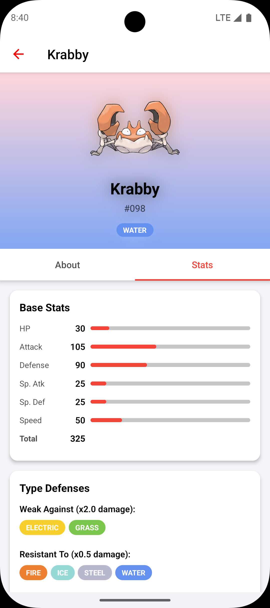

# Pokedex

A react native app to search for pokemons and view it's details
## Features
- Search for pokemons by their name or national pokedex number.
- View details of pokemons.
- Supports dark and light mode.
- Optimised for landscape mode as well.

## Getting Started

> **Note**: Make sure you have completed the [Set Up Your Environment](https://reactnative.dev/docs/set-up-your-environment) guide before proceeding.

## Step 1: Start Metro

First, you will need to run **Metro**, the JavaScript build tool for React Native.

To start the Metro dev server, run the following command from the root of your React Native project:

```sh
# Using npm
npm start

# OR using Yarn
yarn start
```

## Step 2: Build and run your app

With Metro running, open a new terminal window/pane from the root of your React Native project, and use one of the following commands to build and run your Android or iOS app:

### Android

```sh
# Using npm
npm run android

# OR using Yarn
yarn android
```

### iOS

### 🚧 **This project has not been tested on iOS yet** 🚧

For iOS, remember to install CocoaPods dependencies (this only needs to be run on first clone or after updating native deps).

The first time you create a new project, run the Ruby bundler to install CocoaPods itself:

```sh
bundle install
```

Then, and every time you update your native dependencies, run:

```sh
bundle exec pod install
```

For more information, please visit [CocoaPods Getting Started guide](https://guides.cocoapods.org/using/getting-started.html).

```sh
# Using npm
npm run ios

# OR using Yarn
yarn ios
```

If everything is set up correctly, you should see your new app running in the Android Emulator, iOS Simulator, or your connected device.

This is one way to run your app — you can also build it directly from Android Studio or Xcode.

# Screenshots (Android)

## Pokemon list & search
        


## Pokemon details
        
        


## Landscape mode on large screens
### Pixel 9 Pro Fold (emulator):
        
        


## Light mode
        
        


## References
- [PokeAPI](https://pokeapi.co/docs/v2)
- [Pokenode-ts](https://github.com/Gabb-c/pokenode-ts) (Used this package to fetch data from pokeapi)
- [Pokedex](https://www.pokemon.com/uk/pokedex) (Used as reference for the grid design on list screen)
- [Pokemondb](https://pokemondb.net/pokebase/6506/there-formula-for-working-pokemons-highest-possible-stats) (Used formula mentioned here for calculating max value of a stat)
- [IconKitchen](https://icon.kitchen/) (Used to generate app icons)
